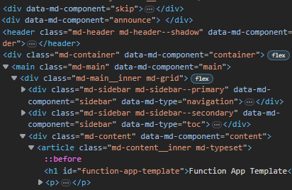
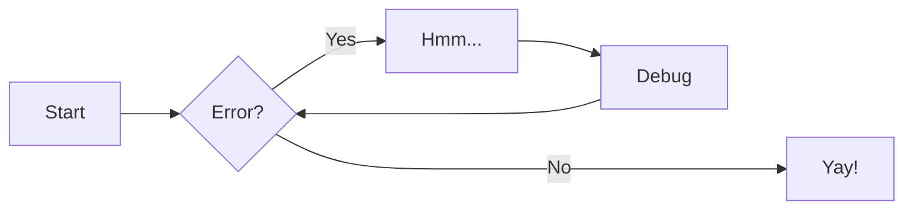

# Feature testing

## Screenshots

A screenshot 😀

## Diagrams

## Project layout

  mkdocs.yml    # The configuration file.
  docs/
      index.md  # The documentation homepage.
      ...       # Other markdown pages, images and other files.

## Video

This section is testing basic MP4 playing functionality

### Video referenced with markdown image format 

(doesnt work)

### Video referenced with &lt;video&gt; tags

<video width="400" controls>
  <source src="./content/vid.mp4" type="video/mp4">
</video>

### Video referenced with &lt;iframe&gt; tags

<iframe width="560" height="315"
    src="content/vid.mp4"
    frameborder="0"
    allow="accelerometer; autoplay; encrypted-media; gyroscope; picture-in-picture"
    allowfullscreen>
</iframe>

### LFS Video referenced by content URL

LFS content works with a workaround, but I have removed content because when creating a new repository from a template, the LFS content is not accessible from the new repository.
